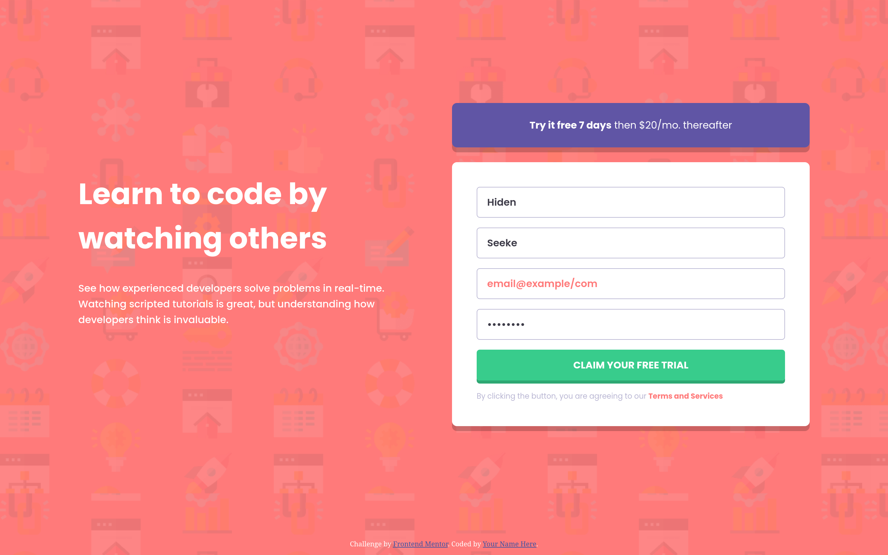

# Frontend Mentor - Intro component with sign up form solution

This is a solution to the [Intro component with sign up form challenge on Frontend Mentor](https://www.frontendmentor.io/challenges/intro-component-with-signup-form-5cf91bd49edda32581d28fd1). Frontend Mentor challenges help you improve your coding skills by building realistic projects.

## Table of contents

- [Overview](#overview)
  - [The challenge](#the-challenge)
  - [Screenshot](#screenshot)
  - [Links](#links)
- [My process](#my-process)
  - [Built with](#built-with)
  - [What I learned](#what-i-learned)
  - [Useful resources](#useful-resources)
- [Author](#author)

## Overview

### The challenge

Users should be able to:

- View the optimal layout for the site depending on their device's screen size
- See hover states for all interactive elements on the page
- Receive an error message when the `form` is submitted if:
  - Any `input` field is empty. The message for this error should say _"[Field Name] cannot be empty"_
  - The email address is not formatted correctly (i.e. a correct email address should have this structure: `name@host.tld`). The message for this error should say _"Looks like this is not an email"_

### Screenshot



### Links

- Solution URL: [GitHub](https://github.com/hexofiteration/intro-component-with-signup-form-master)
- Live Site URL: [GitHub Pages](https://hexofiteration.github.io/intro-component-with-signup-form-master/)

## My process

### Built with

- Semantic HTML5 markup
- CSS custom properties
- Flexbox
- Mobile-first workflow

### What I learned

- When the design doesn't include a `<label>`, aria-label gives inputs an accessible name for screen readers

```html
<input
  type="text"
  name="firstName"
  id="firstName"
  placeholder="First Name"
  aria-label="First Name"
  required
/>
```

- Using HTML validation for the browser checks - `type`, `required` and `pattern`

```html
<input
  type="email"
  name="email"
  id="email"
  placeholder="Email Address"
  aria-label="Email Address"
  pattern="[a-z0-9._%+\-]+@[a-z0-9.\-]+\.[a-z]{2,}$"
  required
/>
```

- using psuedo-classes to color invalid input

```css
input:focus:invalid {
  border-color: var(--Red-400);
}
```

- targeting immediate sibling with `nextElementSibling`

```js
input.nextElementSibling.classList.remove("hide");
```

### Useful resources

- [Labeling Controls](https://www.w3.org/WAI/tutorials/forms/labels/#hiding-label-text) - to hide an element visually but make it available for assistive technologies.
- [Element.nextElementSibling](https://developer.mozilla.org/en-US/docs/Web/API/Element/nextElementSibling) - Helped me target `<div class="error">` as the element immediately after `<input>`.
- [HTML <input> pattern Attribute](https://www.w3schools.com/TAgs/att_input_pattern.asp) - format for correct email address to match the design.

## Author

- Frontend Mentor - [@hexofiteration](https://www.frontendmentor.io/profile/hexofiteration)
